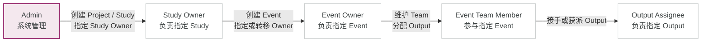
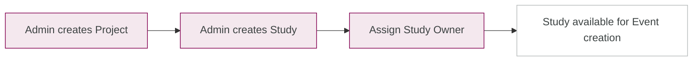
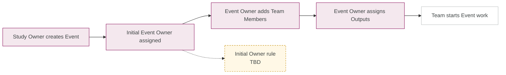
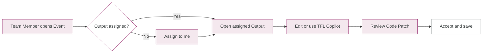

# ATLAS 权限与关键流程

> 客户设计评审速览 · 2026-09-21  
> `Admin` 是固定系统角色；其余权限来自用户与具体 Study、Event 或 Output 的关系。权限可叠加。

## 1. 权限关系

权限按对象范围生效，同一用户拥有多种关系时取权限并集。

## 2. 权限矩阵

| Capability | Admin | Study Owner | Event Owner | Team Member | Output Assignee |
|---|---|---|---|---|---|
| Create Project / Study | Allowed | Not granted | Not granted | Not granted | Not granted |
| Change Study Owner | Allowed | Own Study | Not granted | Not granted | Not granted |
| Create Event | Not granted | Own Study | Not granted | Not granted | Not granted |
| Change Event Owner | Not granted | Own Study | Own Event | Not granted | Not granted |
| Edit / delete Event | Not granted | Not granted | Own Event | Not granted | Not granted |
| Add Team Member | Not granted | If member | If member | Allowed | If member |
| Remove Team Member | Not granted | Not granted | Own Event | Not granted | Not granted |
| Assign Output to others | Not granted | Not granted | Own Event | Not granted | Not granted |
| Assign Output to self | Not granted | If member | If member | Available Output | Available Output |
| Edit Output / use TFL Copilot | Not granted | If assigned | If assigned | If assigned | Assigned Output |
| Use Event Copilot / download | Not granted | If member | Allowed | Allowed | Allowed |
| View Event basics | Allowed | Allowed | Allowed | Allowed | Allowed |

**Legend**

- **Allowed**：该身份直接获得权限。
- **Own / Assigned / If member**：仅在对应对象关系成立时允许。
- **Not granted**：该身份本身不赋予此权限，用户可能通过其他关系获得。

## 3. 关键用户流程

### A. 建立 Project 与 Study

### B. 创建 Event 与团队

### C. 执行与协作

## 4. 客户需确认

| TBD | 当前 Demo 口径 |
|---|---|
| Event 初始 Owner | 创建 Event 的 Study Owner 自动成为 Owner |
| Owner 转移后的旧 Owner | 保留为普通 Event Team Member |
| Disabled Project / Study | 阻止新建，已有 Event 的可操作范围待确认 |
| Event Owner 账号失效 | 由 Study Owner 更换；提醒与限制方式待确认 |

