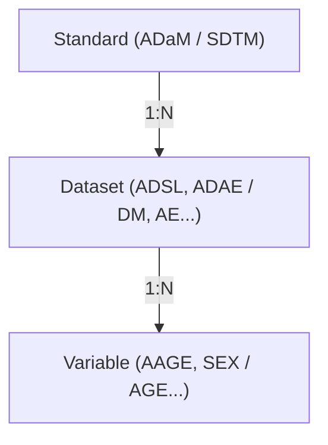

# Metadata: Source Dataset(s) & Variable(s) 联动规范

### 摘要信息
* **定义**：Source Dataset(s) 与 Variable(s) 双字段在 TFL / Listing / Chart 元数据表单中的联动与数据一致性规则。
* **适用范围**：Atlas 属性面板、Inline 变量下拉选择器、Browse Variables 弹窗。
* **更新日期**：2026-08-27

---

### 一、 名词定义与层级关系

| 实体 | 定义 | 归属规则 |
| --- | --- | --- |
| **Standard** | CDISC 数据标准（ADaM / SDTM）。 | 顶层分类。 |
| **Dataset** | 临床分析/原始数据集。 | **天然单亲归属**：每个 Dataset 唯一且固定归属于一个 Standard。 |
| **Variable** | 业务变量。 | **唯一标识**：由 `Dataset.Variable` 唯一定位，不同 Dataset 下允许同名变量。 |

---

### 二、 核心原则：非对称联动 (Asymmetric Coupling)

1. **向下约束（Dataset → Variable）**：
   * **Inline 快速选择（640px 下拉）**：若 Source Dataset(s) 非空，执行**硬收窄**，仅展示指定 Dataset 下的变量；若 Source Dataset(s) 为空，开放全量检索。
2. **向上扩展（Variable → Dataset）**：
   * **Modal 完整浏览（800px 弹窗）**：默认按 Source Dataset(s) 范围初始化过滤器，但**允许越级浏览与勾选**。
   * 用户在 Modal 中选中国元数据范围外的变量时，在点击 Confirm 时**自动将对应 Dataset 追加至 Source Dataset(s)**。
3. **视图层与数据层严格解耦**：
   * Modal 内对 FilterChip 的开启、关闭、切换仅作用于当前弹窗视图，**关闭过滤条件不会删除外层表单的 Source Dataset(s)**。

---

### 三、 交互状态流转表 (Status Table)

| 场景 | 触发条件 | UI / 交互行为 | 数据处理结果 |
| --- | --- | --- | --- |
| **Inline 下拉展开** | Source Dataset(s) 非空 | 仅列出当前 Dataset 范围内的变量；FilterChip 显示当前生效范围。 | 不修改任何元数据。 |
| **Inline 下拉展开** | Source Dataset(s) 为空 | 列出所有 Standard 与 Dataset 的变量；FilterChip 默认 `All`。 | 不修改任何元数据。 |
| **Modal 弹窗打开** | 点击 Browse All Variables | 智能初始化 Filter： 1. Dataset 为空 → Standard 为 `All` 2. Dataset 全属于 ADaM → Standard 预设为 `ADaM only` 3. Dataset 跨 Standard → Standard 为 `All` | 读取外层数据，初始化弹窗本地状态。 |
| **Modal 过滤调整** | 用户在 Modal 内关闭 FilterChip | 列表扩展为全量数据，展示所有可用变量。 | **不修改**外层 Source Dataset(s)。 |
| **Modal 越级勾选** | 勾选当前 Dataset 范围外的变量 | 1. 变量进入 Selected Bar 2. Modal Footer 左下角展示提示：`Will automatically add [Dataset] to Source Dataset(s)` | 暂存于弹窗临时状态。 |
| **Modal 取消越级** | 在 Selected Bar 移除所有越级变量 | Footer 左下角提示实时自动消失。 | 临时状态清除追加标记。 |
| **Modal 提交确认** | 点击 Confirm | 1. 关闭 Modal 2. Variable 字段写入已选变量 3. Source Dataset(s) 字段自动合并新追加的 Dataset（去重并集） | 持久化写入表单元数据。 |
| **Modal 取消退出** | 点击 Cancel 或蒙层关闭 | 关闭 Modal，销毁临时勾选与追加状态。 | 表单 Variable 与 Dataset 保持原样。 |

---

### 四、 前端实现行为边界 (Do / Don't)

#### Do (必须执行)
* **Do**: 变量唯一性比对与反向推导必须基于 `Dataset.Variable` 复合键。
* **Do**: Modal 底部提示 `Will automatically add [Dataset] to Source Dataset(s)` 必须与 Selected Bar 的勾选状态严格联动，包含多个新 Dataset 时使用英文逗号拼接（如 `Will automatically add DM, LB to Source Dataset(s)`）。
* **Do**: 无论用户在 Modal 中如何切换 Tab 或 Filter，Selected Bar 必须持续保留并完整展示所有已选变量 Tag。
* **Do**: 外部表单的 Dataset 字段合并逻辑必须执行并集去重（`prevDatasets ∪ newInferredDatasets`）。

#### Don't (严格禁止)
* **Don't**: 严禁在用户移除 Modal 内的 FilterChip 时触发对外层 Dataset 字段的删除。
* **Don't**: 严禁在 Inline 640px 下拉内提供跨 Dataset 的越级勾选（必须保持快速入口的高收窄心智，跨范围需求统一由 Modal 承载）。
* **Don't**: 严禁在用户点击 Cancel 或 ESC 关闭弹窗时留下任何数据变更副作用。

---

### 五、 决策记录与待确认项 (Decisions & TBDs)

| 问题项 | 最终决策 / 当前状态 | 影响范围 |
| --- | --- | --- |
| Modal 预设 Filter 是否允许手动关闭 | 允许关闭，且关闭仅扩宽当前浏览视窗，不影响已存 Dataset。 | BrowseVariablesModal |
| Filter 视觉提示文案 | FilterChip 自身已明确当前选中项，不添加额外提示文案，避免信息冗余。 | Inline & Modal |
| 越级勾选感知位置 | 统一在 Modal Footer 左下角显示轻量提示文本，符合操作前明确后果规范。 | BrowseVariablesModal Footer |
| 删除 Source Dataset 后的级联处理 | 建议采用软级联/保护提示（删除 Dataset 前若存在该 Dataset 下的已选 Variable 则提示用户）。 | 属性面板 Dataset 字段 |
| AI 返回未定义变量时的兜底 | 需后端与 AI 架构师确认。 | AI 生成流程 |