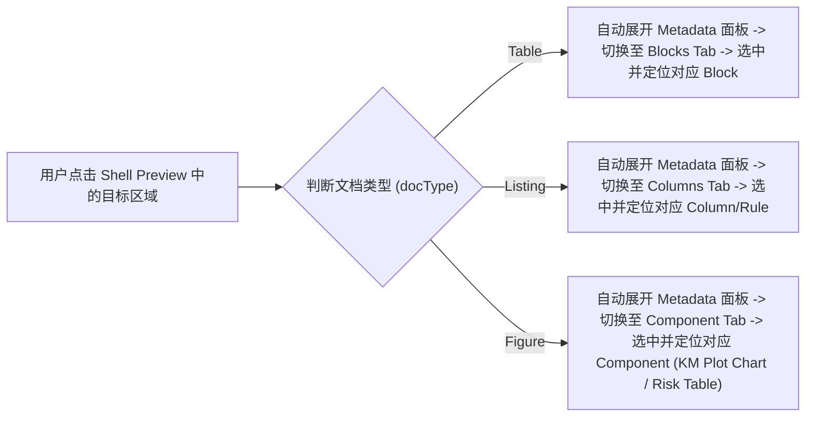

# Shell Preview 权威设计与交互规范 2.0 (Shell Preview Master Design & Interaction Spec)

本文档归纳并收敛了 2.0 版本迭代中 Shell Preview 的所有排版、表格渲染、Hover 校验浮层以及全局 Metadata 点击联动机制，作为唯一的权威设计与开发依据。

---

## 一、全局布局与容器规范 (Panel Layout & Canvas Specs)

### 1.1 面板容器 (Shell & Code Panel Card)
* **圆角 (Border Radius)**：`rounded-[8px]` (`border-radius: 8px`)
* **边框 (Border)**：`border border-graphite-15` (`1px solid #E6E8E8`)
* **阴影 (Elevation 1 Shadow)**：`box-shadow: 0 1px 2px 0 rgba(0,0,0,0.03), 0 4px 12px -2px rgba(63,68,68,0.05)`
* **阴影裁剪保护**：所有外层 Flex/Grid 父级容器禁止使用 `overflow-hidden`，确保面板四周 Shadow 完整自然绽放，不被视窗边缘切断。

### 1.2 视窗与网格间距 (Viewport Margins & Panel Gap)
* **视窗外留白**：最右侧面板的右边界距视窗边缘严格保留 **4px**（`p-[4px]` / `px-[4px]`）。
* **内部物理间距**：Shell / Code / Metadata 面板之间的物理卡片间隙为 **6px**（`gap-[6px]`）。

### 1.3 画布底色 (Canvas Background)
* Paper 纸张预览下方与四周的背景底色统一设定为 **`#F5F5F5`**。

### 1.4 缩放/视角控制 (Zoom & Scale Control)
* **缩放控制位置**：Shell Preview 右上角 `PanelHeader` 的 Action 区域包含一个固定宽度的 Dropdown 控件（`w-[76px]`）。
* **支持缩放比例**：提供 `75%`、`100%`（默认）、`150%`、`200%` 四档预设比例。
* **实现原理**：选中的比例缩放因子传递给 `ZoomContainer`，通过 CSS `transform: scale(scale)` 针对画布内容区进行平滑无损放缩，且不撑破/遮挡外部 Flex 布局。

### 1.5 Metadata 面板拉伸与 Components/Blocks 双栏自适应规范
* **外层尺寸约束**：
  * **Shell-Only 视图**：默认 `380px`，最小 `320px`，最大 `640px`。
  * **Code & Shell 视图**：默认 `380px`，最小 `280px`，最大 `520px`。
* **Components / Blocks Tab View 内部双栏规则**：
  * **左侧列表导航栏**：默认 `176px` (`w-[176px]`)，具备 `min-w-[90px]` 动态压缩弹性能力，文字过长时自动 `truncate`。
  * **右侧字段详情区**：`flex-1 min-w-0` 占据剩余空间。
  * **拉伸/压缩顺序**：面板拓宽时由右侧 `flex-1` 吸收；面板压缩至极限时，左侧导航栏由 176px 配合收缩至 90px。详见 [`Responsive-Design-2.0.md`](file:///Users/ruini.ou/Downloads/AI%20Copilot/guidelines/Global%20Features/Responsive-Design-2.0.md)。

---

## 二、排版与字体层级 (Unified Typography Hierarchy)

对标 Design System 2.0 的 `Small Text` 规范，Table / Figure / Listing 全面统一字体层级：

| 区块 | Token / Class | 字号 / 字重 / 行高 | 颜色 Token | 适用范围 |
|---|---|---|---|---|
| **主标题 (Main Title)** | `Small Text/Table` (`t-table`) | `13px / Medium (500) / 16px lh` | `text-primary` (`#3C4242`) | Table / Figure / Listing 主标题 |
| **表头列名 (Column Label)** | `Small Text/Small Medium` (`t-small-medium`) | `12px / Medium (500) / 20px lh` | `text-primary` (`#3C4242`) | Table & Listing 表头列名 (对齐: `align-top text-left`) |
| **Parent 行标签** | `Small Text/Micro` (`t-micro`) | `10px / Medium (500) / 14px lh` | `text-primary` (`#3C4242`) | Table Parent 分组行标签 |
| **Subgroup / Listing 行** | `Small Text/Footnote` (`t-footnote`) | `10px / Regular (400) / 14px lh` | `text-secondary` (`#656969`) | Table Subgroup 行 & Listing 明细行 |
| **数值单元格** | `Small Text/Footnote` (`t-footnote`) | `10px / Regular (400) / 14px lh` | `text-primary` (`#3C4242`) | Table & Listing 数值/数据 |
| **Footnote & Study Info** | `Small Text/Footnote` (`t-footnote`) | `10px / Regular (400) / 14px lh` | `text-secondary` (`#656969`) | 页眉 AZ/Study 行、页脚 Footnote |

---

## 三、表格与数据行渲染规范 (Table / Listing / Figure Table Specs)

### 3.1 Table 行渲染规范
* **Parent 行 (Group Start)**：高度固定 **24px** (`h-[24px]`)，Padding `py-[6px] px-[6px]`。
  * **灰色分割线**：起始于 Parent 行**上端** (`border-t border-t-border-default`)。
  * **首行免加规则**：全表第一个 Parent 行紧贴表头底部的 2px 黑色粗线，自动取消灰色线（`group-first:border-t-0`）。
* **Subgroup 行 (明细行)**：高度固定 **18px** (`h-[18px]`)，Padding `py-[1px] px-[6px]`。内部无横向分割线（`border-t-0 border-b-0`）。

### 3.2 Listing 数据明细行规范（对标 Subgroup 级）
* **业务模型**：Listing 代表受试者单条明细记录，对应 Domain Model 的 Subgroup 级数据。
* **数据行尺寸**：高度固定 **18px** (`h-[18px]`)，Padding **`py-[1px] px-[6px]`**，字体 **`10px Regular`**。
* **无内部横向线**：由于 Listing 无 Group 分组，数据行内部**不加横向灰色分割线**（`border-b-0`），仅由顶部表头 2px 黑粗线和全表底部 2px 黑粗线框定。

### 3.3 横向 2px 黑粗线图层覆盖 (Z-Index Border Layering)
* **图层置顶**：表头底部 2px 黑色粗线及表格最底部的 2px 黑色粗线赋上 **`relative z-10`**。
* **设计效果**：保证横向 2px 黑色粗线的图层在视觉上绝对压在所有 1px 灰色竖线（`border-r`）之上，消除了交点处竖线穿透或打断黑线的参差感。

---

## 四、Hover 交互与 3 行内联表头 (Hover & Metadata Display)

### 4.1 Table 块级 Hover
* **触发区域**：Table 的每一个完整 Block (Group)。
* **校验浮层 (Tooltip)**：展示 P1 (Key Variable Mapping) + P2 (Population) + P3 (Display/Statistic Rule) 只读元数据信息。

### 4.2 Listing 3 行内联表头结构 (Listing 3-Line Header)
1. **Line 1 (列名)**：`12px Medium` 加粗列标题。
2. **Line 2 (`dataset.variable`)**：`10px Regular text-secondary` 映射变量。
3. **Line 3 (`rule: {内容}`)**：`10px Regular text-secondary` 派生规则，超过 2 行自动截断显示 `...`。
* **列冻结交互隔离**：列冻结手柄由原本 Hover Column Header 转移至**列与列之间的分割线边界**，释放表头区域供元数据展示与点击。

### 4.3 Figure 按 Component 独立 Hover 拆分
* **拆分机制**：Figure (如 KM Plot) 按照 Metadata 的 Component 进行区域拆分：
  * **KM Plot Chart 区域**：仅包含 SVG 曲线图，Hover 时触发局部 `hover:bg-black/5`。
  * **Number at Risk Table 区域**：仅包含下方的风险人数表格，Hover 时触发局部 `hover:bg-black/5`。

---

## 五、全局点击跳转 Metadata 机制 (Global Click-to-Metadata Deep-Linking)

点击跳转 Metadata 为 **全局通用交互规则**，对 Table、Listing、Figure 全面生效：

1. **Table 点击**：点击 Parent 行或数据区域 -> 自动展开侧边栏 -> 切至 `Blocks` Tab -> 高亮并定位当前 Block。
2. **Listing 点击**：点击 Column Header 或 Line 3 (Rule) -> 自动展开侧边栏 -> 切至 `Columns` Tab -> 高亮并定位当前列元数据。
3. **Figure 点击**：点击 `KM Plot Chart` 或 `Number at Risk Table` -> 自动展开侧边栏 -> 切至 `Component` Tab -> 高亮并定位 `kmCurve` 或 `riskTable` 组件卡片。

---

> **维护说明**：本规范收录并终结了所有零散的提案草案，后续 Shell Preview 相关的任何样式或交互变更请统一更新至本文档。
